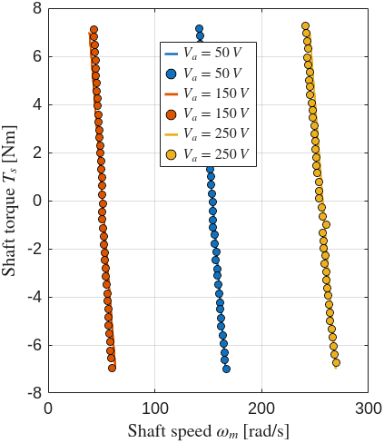
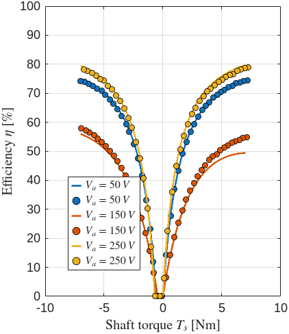
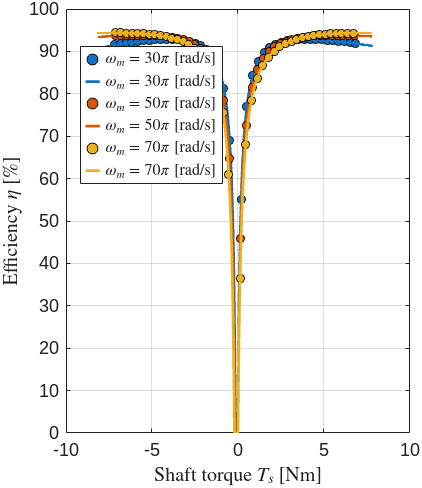
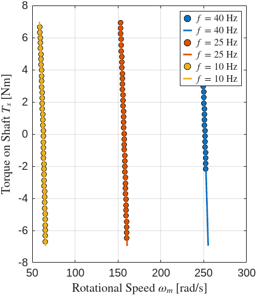

# Electromechanics (5EWA0), TU/e

MATLAB work for the Electromechanics course (5EWA0) at Eindhoven University of Technology. The repository has two parts: homework scripts that work through magnetic circuits and the steady-state analysis of DC, synchronous, and induction machines, and a lab in which theoretical machine models are validated against measurements taken on a machine test bench. The lab is written up as a paper, `Tyukov_1819283_Paper.pdf`. The figures below are produced by running the lab scripts against the measurement data in this repository.

## Homework

`Homework_I_script.m` solves a magnetic circuit with a permanent magnet by building a reluctance network (magnet, stator legs, air gaps, and back iron, with a stacking factor on the laminated sections) and computing the flux driven by the magnet.

`Homework_II_script.m` covers DC machines: back-EMF and the torque constant of a separately excited machine, the effect of field current on speed and torque, and shunt and series connections.

`Homework_III_script.m` covers a three-phase synchronous machine: pole count from speed and frequency, the excitation-EMF phasor from the terminal voltage and armature impedance, the torque (load) angle, developed torque, copper and friction-and-windage losses, and efficiency.

`Homework_IV_script.m` extracts the equivalent-circuit parameters of an induction motor from no-load, blocked-rotor, and DC tests (stator and rotor resistance, leakage reactances, magnetizing branch), then uses them to find slip, input current, power factor, developed power, and efficiency at an operating point.

## Lab: model validation on a machine test bench

The lab compares steady-state torque-speed and efficiency models for three machine types against measurements. Each machine under test is coupled to a DC machine on the bench that acts as an adjustable mechanical load or drive, so the setup can be swept through motoring and generating operation. The measurement recordings (`Lab/.../Measurement_Data/*.mat`, the large files in this repository) hold time series of armature current and voltage of the DC machine, RMS phase current and voltage of the AC machine, power factor, and shaft speed. `Daniel_DC.m`, `Daniel_PMSM.m`, and `Daniel_IM.m` window and average each recording into operating points, evaluate the analytical model over a torque or current sweep, and overlay the two.

### Separately excited DC machine

`Daniel_DC.m` measures the torque-speed characteristic and efficiency at three armature voltages (50, 150, 250 V). The near-vertical torque-speed lines are the stiff speed regulation of the separately excited machine; efficiency rises with load and with armature voltage.





Lines are the model, filled circles are the bench measurements.

### Permanent magnet synchronous machine

`Daniel_PMSM.m` models the PMSM (8 pole pairs) from its resistance and synchronous inductance and compares efficiency and power factor against measurements at three mechanical speeds. Efficiency is high across most of the load range and drops only near zero torque.



### Induction machine

`Daniel_IM.m` uses the equivalent-circuit parameters to predict the torque-speed and efficiency of the induction machine at three supply frequencies (10, 25, 40 Hz), reproducing the way the characteristic shifts with the synchronous speed set by the drive frequency.



## Repository layout

```
Homework_I_script.m .. Homework_IV_script.m   magnetic circuit, DC, synchronous, induction machine analysis
Lab/
  Daniel_DC.m, Daniel_IM.m, Daniel_PMSM.m     model vs measurement scripts (this author's version)
  Khanh_DC.m, Khanh_IM.m, Khanh_PMSM.m        lab partner's versions
  Measurement_Data/                           bench recordings (.mat) used by the scripts
  Lab_Data/Lab 1..3/                          per-session templates, model-graph scripts, and raw data
Tyukov_1819283_Paper.pdf                      lab report
docs/readme/                                  figures produced by the lab scripts, used in this README
```

The `.mat` measurement files are large (the repository is around 170 MB) because they are full time-domain recordings of currents, voltages, power factor, and speed sampled across every operating point on the bench.

## Running

The scripts run in MATLAB. Add the relevant `Measurement_Data` folder to the path (or run from inside it) so the `load('Measurement_*.mat')` calls resolve, then run a lab script to reproduce its figures. The homework scripts are self-contained and can be run directly.

## Technologies

- MATLAB
- MATLAB Live Scripts (`.mlx`) for several lab exercises
